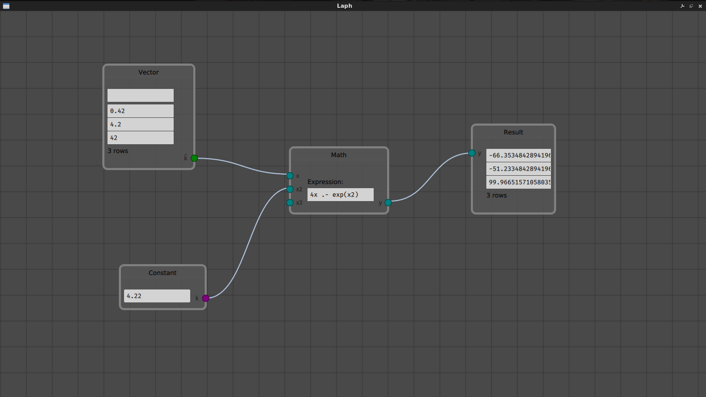

# Intro
Laph is a program designed for use in physics labs/experiments, born out of the
authors abhorrence of Excel. Instead of tables and cells, Laph uses nodes to
build a DAG (Directed Acyclic Graph) of computations.

Laph includes an embedded [Julia](https://julialang.org/) runtime, which is used
to compute the graph. Each node (except for input nodes) is backed by a Julia
file containing functions that map to each output socket; and this provides an
enormous amount of flexibility when it comes to processing the data.



## Requirements
* A C++14 compliant compiler
* Qt 5.11 or higher
* Julia 1.0 or higher

## Roadmap
- [x] Create a draggable canvas and nodes/sockets/wires
- [x] Embed Julia
- [x] Initial version of a lazily-evaluated graph engine
- [ ] Undo/redo *[in progress]*
- [ ] Unit tests
- [ ] Support for saving the node graphs (including node settings and vector data)
- [ ] Plotting support (most likely using [QCustomPlot](https://www.qcustomplot.com/))
- [ ] Optimize the graph engine

## Quickstart
Assuming we are in the cloned repo directory:

```bash
qmake-qt5
make
```

Note that the path to the Julia libraries/headers are expected to be in
`JULIA_LIB_PATH` and `JULIA_INCLUDE_PATH`, respectively.
